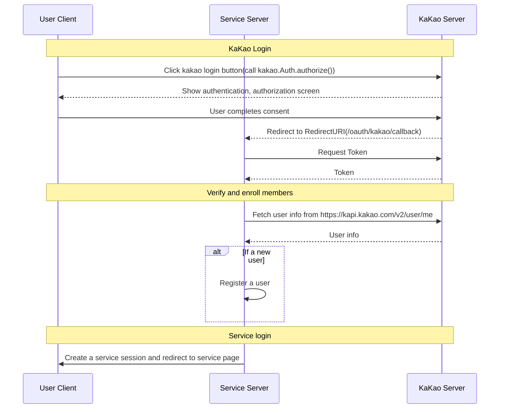

# nextjs with kakao login

## Stack

- Language: 
- Authentication: , KAKAO Login
- Deploy and Database:  [Vercel Postgres](https://vercel.com/docs/storage/vercel-postgres)
- Frontend and Server: 
- Validation: 
- ORM: 


## Description

카카오 로그인을 이용한 간단한 로그인 기능을 구현하는 예제입니다.

This is a [Next.js](https://nextjs.org/) project bootstrapped with [`create-next-app`](https://github.com/vercel/next.js/tree/canary/packages/create-next-app).


## Diagram




## Getting Started

First, run the development server:

```bash
npm run dev
# or
yarn dev
# or
pnpm dev
# or
bun dev
```

Open [http://localhost:3000](http://localhost:3000) with your browser to see the result.


